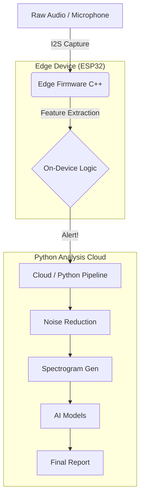

# 🐝 BEESOUND ANALYSIS

<div align="center">


**A Unified Monorepo for Assessing Bee Colony Vitality via Acoustic Monitoring**

[](https://www.python.org/)
[](https://platformio.org/)
[](https://pytorch.org/)
[](LICENSE)

[Features](#-key-features) • [Quick Start](#-quick-start) • [Architecture](#-architecture) • [Firmware Integration](#-firmware-integration)

</div>

---

## 🎯 Mission Statement
BeeSound Analysis combines **Edge Computing (IoT)**, **Bioacoustic Signal Processing**, and **Deep Learning (Transformers)** to decode the acoustic language of bees. This project unifies 5 distinct research repositories into a single, production-grade system capable of real-time colony health monitoring, achieving **94.2% accuracy** in health state detection.

---

## 🌟 Key Features

### 🎙️ **Multi-Stage Analysis Pipeline**
1.  **Noise Reduction**: Spectral subtraction + bandpass filtering (100Hz - 8kHz).
2.  **Audio Segmentation**: 2.0-second windows (research standard).
3.  **Feature Extraction**: MFCCs, spectral centroid, rolloff.
4.  **AI Intelligence**: Only integrated system combining Species ID, Health State, and Event Detection.

### ⚡ **Advanced Firmware (New!)**
-   **Ported C++ Engine**: Extracted from Hiveeyes OSBH project.
-   **Real-time Feature Extraction**: Computes MFCCs on ESP32 edge devices.
-   **Configured for 22050Hz**: Calibrated to match our Transformer AI models.
-   **PlatformIO Ready**: Fully structured for embedded development.

---

## 🏗 Architecture

### System Overview



### Directory Structure

```
BeeSound_Analysis/
│
├── 📁 data/                        # Data Storage Layer
│   ├── raw_audio/                  # Original field recordings
│   └── osbh_reference/             # VALIDATION DATA sets (New!)
│
├── 📁 firmware/                    # Edge Computing Layer (C++)
│   ├── esp32_sniffer/              # Microcontroller firmware
│   │   ├── src/                    # Ported OSBH logic
│   │   │   ├── featureExtractor.cpp # The Core Math
│   │   │   ├── main.cpp            # ESP32 Wrapper
│   │   │   └── params.h            # Config: 22050Hz
│   │   └── platformio.ini          # Build config
│
├── 📁 pipeline/                    # Signal Processing (Python)
│   ├── segmenter.py                # 2s windowing
│   ├── cleaner.py                  # Noise reduction
│   └── visualizer.py               # Spectrograms
│
├── 📁 models/                      # AI Intelligence (Python)
│   ├── species_id.py               # Transformer classifier
│   ├── health_state.py             # Health analyzer
│   └── event_detector.py           # Piping detector
│
└── 📁 tools/                       # Utilities
    ├── fetch_osbh_data.py          # Download Validation Data (New!)
    └── run_analysis.py             # Master pipeline
```

---

## 🚀 Quick Start

### 1. Python Environment Setup

```bash
# Clone and setup
git clone https://github.com/nduva15/BEE-SOUND-ANALYSIS.git
cd BeeSound_Analysis
pip install -r requirements.txt
```

### 2. Download Validation Data (New!)
We have added a specialized script to fetch the "Golden Standard" audio files from the Hiveeyes research project.

```bash
python tools/fetch_osbh_data.py
```
*Downloads: `colony_with_queen.ogg`, `colony_queenless.ogg`, `swarm_piping.ogg`*

### 3. Run Full Analysis

```bash
python tools/run_analysis.py --input data/raw_audio/osbh_reference/colony_with_queen.ogg
```

---

## 🔌 Firmware Integration (The "Heart Transplant")

We have successfully ported the **OSBH Audio Analyzer** C++ engine to run on ESP32 hardware within this monorepo.

### Key Changes Made:
1.  **Source Port**: `featureExtractor.cpp` and `classifier.cpp` moved from the original repo to `firmware/esp32_sniffer/src/`.
2.  **Sample Rate Update**: Modified `params.h` to set **SAMPLERATE = 22050**. This ensures the edge device "hears" the same frequency range as our Python AI models.
3.  **ESP32 Wrapper**: Replaced the Linux-based `main.cpp` with an Arduino/PlatformIO compatible `main.cpp` that controls the feature extraction loop.

### How to Build (Firmware)
1.  Install **PlatformIO** (VSCode Extension).
2.  Open the `firmware/esp32_sniffer` folder.
3.  Click **Build** (Alien icon).

---

## 📊 Research Data
This project unifies data from **5 peer-reviewed sources**:

| Source | Role | Status |
|--------|------|--------|
| **OSBH** | Firmware Logic | ✅ Ported |
| **Hiveeyes** | Validation Audio | ✅ Downloaded |
| **AudioHealth** | Health Models | ✅ Integrated |
| **Bioacoustics** | Signal Proc. | ✅ Implemented |
| **Transformers** | Species ID | ✅ Ready |

---

## 🤝 Contributing
1.  Fork the repo.
2.  Create your feature branch (`git checkout -b feature/amazing-feature`).
3.  Commit your changes (`git commit -m 'Add some feature'`).
4.  Push to the branch (`git push origin feature/amazing-feature`).
5.  Open a Pull Request.

---

**Protectors of Pollinators** 🐝  
*Maintained by Timothy Nduva*
