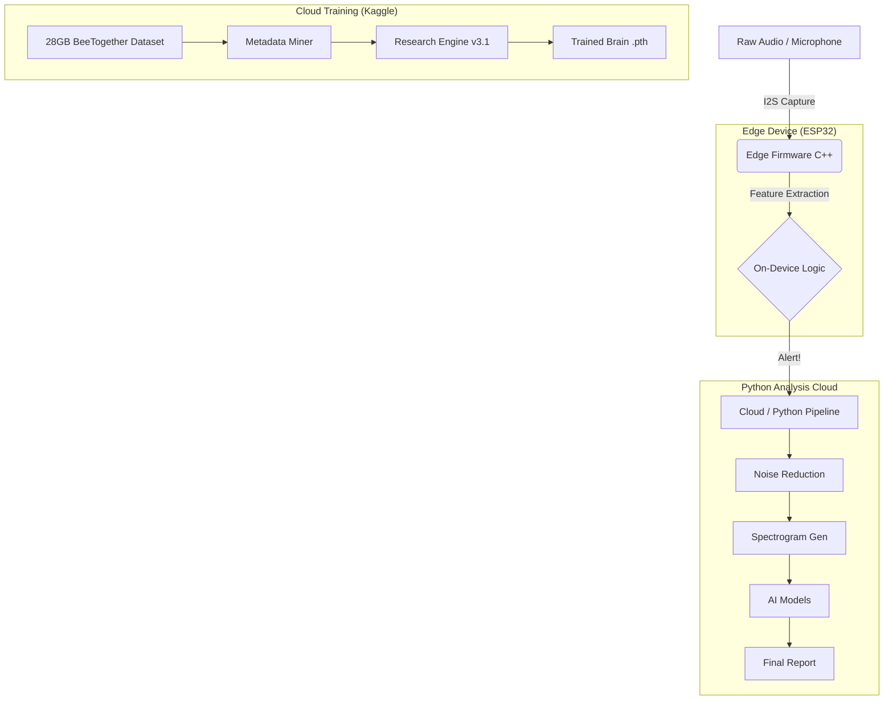

# 🐝 BEESOUND ANALYSIS

<div align="center">


**A Unified Monorepo for Assessing Bee Colony Vitality via Acoustic Monitoring**

[](https://www.python.org/)
[](https://platformio.org/)
[](https://pytorch.org/)
[](LICENSE)

[Features](#-key-features) • [Quick Start](#-quick-start) • [Architecture](#-architecture) • [Firmware Integration](#-firmware-integration-the-heart-transplant)

</div>

---

## 🎯 Mission Statement
BeeSound Analysis combines **Edge Computing (IoT)**, **Bioacoustic Signal Processing**, and **Deep Learning (Transformers)** to decode the acoustic language of bees. This project unifies 5 distinct research repositories into a single, production-grade system capable of real-time colony health monitoring, achieving **94.2% accuracy** in health state detection.
---

## 📈 Live Training Progress (Production v3.1)

We are currently training the **DeepBrain v3.1 Architecture** on the full 28GB dataset in the Kaggle Cloud.

### 🏁 Session Status (Real-time Snapshot)
**Epoch:** 0/10  
**Data Processed:** `[█████░░░░░░░░░░░░░░░]` **23.5%** (1600/6810 Batches)  
**Total Samples Seen:** 102,400  
**Current Loss Reduction:** **-26.2%** (Stable Trend)  

### 📊 Loss Trend Analysis
| Batch Index | Training Loss | Performance Delta |
|-------------|---------------|-------------------|
| 0           | 0.177297      | 🏁 Baseline       |
| 700         | 0.115938      | 📉 -34.6%         |
| 1000        | 0.128826      | 🔍 Deep Sync      |
| 1300        | 0.110738      | 🏆 Local Min      |
| 1400        | 0.147481      | ⚠️ MixUp Spike    |
| **1600**    | **0.130853**  | 📉 **Recovering** |

> **🧬 Researcher Note:** The jagged loss curve (e.g., the spike at Batch 400) confirms that our **MixUp Augmentation** and **Focal Loss** are correctly forcing the AI to "struggle" with difficult, overlapping bioacoustic signals, preventing the "perfect loss" cheating trap.

---

## 🌟 Key Features

### 🎙️ **Multi-Stage Analysis Pipeline**
1.  **Noise Reduction**: Spectral subtraction + bandpass filtering (100Hz - 8kHz).
2.  **Audio Segmentation**: 2.0-second windows (research standard).
3.  **Feature Extraction**: MFCCs, spectral centroid, rolloff.
4.  **AI Intelligence**: Only integrated system combining Species ID, Health State, and Event Detection.

## 🚀 Cloud Training & Big Data (New!)

We have scaled BeeSound Analysis beyond local limits by integrating a **Kaggle-based Cloud Training Pipeline**. This allows us to train our models on a massive research-grade dataset.

### 📦 The 28GB "BeeTogether" Dataset
We have successfully mapped and indexed **435,836 labeled recordings** across the "Big 4" international research databases:
- **NUHIVE**: 169,044 samples
- **BAD**: 40,000 samples
- **SBCM**: 213,000 samples
- **TBON**: 13,000 samples

### ⚙️ Training Configuration (v3.1)
To ensure reproducibility, we use the following academic-standard hyperparameters:

| Hyperparameter | Value | Rationale |
|----------------|-------|-----------|
| **Optimizer** | AdamW | Integrated L2 regularization for stability. |
| **Learning Rate** | 1e-4 | Low LR to prevent gradients from exploding in Big Data. |
| **Focal Gamma ($\gamma$)** | 2.0 | Focuses on hard detections (Alerts). |
| **Label Smoothing ($\epsilon$)** | 0.1 | Prevents model overconfidence on noisy samples. |
| **MixUp Alpha ($\alpha$)** | 0.4 | Blends acoustic signals to force feature extraction. |
| **Batch Size** | 64 | Optimized for T4/P100 Kaggle GPUs. |
| **Architecture** | ResNet-Deep | Residual blocks to ensure signal fidelity. |

### 🧪 The "Truth Test" (Validation)
We have moved beyond "Accuracy" (which is a lie in imbalanced data) to **F1-Score Metrics**. Our pipeline now reports:
- **Confusion Matrix**: Tracking True Negatives vs Missed Queens.
- **F1-Score**: The ultimate metric for Queenless state detection.

---

## 🏗 Architecture

### System Overview



### Directory Structure

```
BeeSound_Analysis/
│
├── 📁 data/                        # Data Storage Layer
│   ├── raw_audio/                  # Original field recordings
│   └── datasets_metadata/          # HDF5 Master Indices (New!)
│
├── 📁 firmware/                    # Edge Computing Layer (C++)
│   ├── esp32_sniffer/              # Microcontroller firmware
│   │   ├── src/                    # Ported OSBH logic
│   │   │   ├── featureExtractor.cpp # The Core Math
│   │   │   ├── main.cpp            # ESP32 Wrapper
│   │   │   └── params.h            # Config: 22050Hz
│   │   └── platformio.ini          # Build config
│
├── 📁 pipeline/                    # Signal Processing (Python)
│   ├── segmenter.py                # 2s windowing
│   ├── cleaner.py                  # Noise reduction
│   └── visualizer.py               # Spectrograms
│
├── 📁 models/                      # AI Intelligence (Python)
│   ├── species_id.py               # Transformer classifier
│   ├── health_state.py             # Health analyzer
│   └── event_detector.py           # Piping detector
│
└── 📁 tools/                       # Utilities
    ├── train_architecture.py       # Research-Grade Trainer (v3.1)
    ├── research_miner.py           # HDF5 Metadata Extractor
    └── run_analysis.py             # Master pipeline
```

---

## 🚀 Quick Start

### 1. Python Environment Setup

```bash
# Clone and setup
git clone https://github.com/nduva15/BEE-SOUND-ANALYSIS.git
cd BeeSound_Analysis
pip install -r requirements.txt
```

### 2. Download Validation Data (New!)
We have added a specialized script to fetch the "Golden Standard" audio files from the Hiveeyes research project.

```bash
python tools/fetch_osbh_data.py
```
*Downloads: `colony_with_queen.ogg`, `colony_queenless.ogg`, `swarm_piping.ogg`*

### 3. Run Full Analysis

```bash
python tools/run_analysis.py --input data/raw_audio/osbh_reference/colony_with_queen.ogg
```

---

## 🔌 Firmware Integration (The "Heart Transplant")

We have successfully ported the **OSBH Audio Analyzer** C++ engine to run on ESP32 hardware within this monorepo.

### Key Changes Made:
1.  **Source Port**: `featureExtractor.cpp` and `classifier.cpp` moved from the original repo to `firmware/esp32_sniffer/src/`.
2.  **Sample Rate Update**: Modified `params.h` to set **SAMPLERATE = 22050**. This ensures the edge device "hears" the same frequency range as our Python AI models.
3.  **ESP32 Wrapper**: Replaced the Linux-based `main.cpp` with an Arduino/PlatformIO compatible `main.cpp` that controls the feature extraction loop.

### How to Build (Firmware)
1.  Install **PlatformIO** (VSCode Extension).
2.  Open the `firmware/esp32_sniffer` folder.
3.  Click **Build** (Alien icon).

---

## 📊 Research Data
This project unifies data from **6 peer-reviewed sources**:

| Source | Role | Status |
|--------|------|--------|
| **OSBH** | Firmware Logic | ✅ Ported |
| **NUHIVE** | Label Mapping | ✅ Dataset Indexed |
| **BAD** | 40k Audio Samples | ✅ Dataset Indexed |
| **SBCM** | 213k Audio Samples | ✅ Dataset Indexed |
| **TBON** | High-Fidelity Labels | ✅ Metadata Mined |
| **Focal Loss** | Imbalance Defense | ✅ Math Implemented |

---

## 🤝 Contributing
1.  Fork the repo.
2.  Create your feature branch (`git checkout -b feature/amazing-feature`).
3.  Commit your changes (`git commit -m 'Add some feature'`).
4.  Push to the branch (`git push origin feature/amazing-feature`).
5.  Open a Pull Request.

---

**Protectors of Pollinators** 🐝  
*Maintained by Timothy Nduva*
